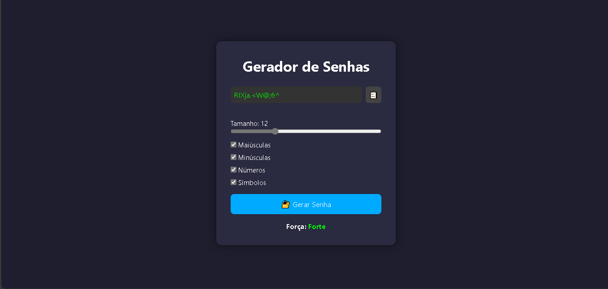

# 🔐 Gerador de Senhas

Um gerador de senhas moderno e responsivo feito com **HTML**, **CSS** e **JavaScript puro**, ideal para uso pessoal ou como projeto de portfólio.

## 🚀 Funcionalidades

- Geração de senhas seguras com:
  - Letras maiúsculas e minúsculas
  - Números
  - Símbolos
  - Controle de tamanho (de 4 a 32 caracteres)
- Avaliação da força da senha gerada
- Copiar senha com 1 clique + feedback visual

## 📸 Preview



🔗 **[Clique aqui para abrir e testar o projeto](https://thalesjuann.github.io/geradordesenhas/)**  

## 🧠 Tecnologias

- HTML5
- CSS3
- JavaScript

## ▶️ Como usar

1. Clone o repositório:
```bash
   git clone https://github.com/thalesjuann/geradordesenhas.git
```

2. Abra o arquivo `index.html` no navegador.

> Nenhuma dependência externa, framework ou instalação necessária.

## 📁 Estrutura

```
📦 gerador-de-senhas/
├── index.html
├── style.css
├── script.js
└── preview.png
```

## 📌 Licença

Este projeto está sob a licença [MIT](LICENSE).

---

Feito por [Thales Juan](https://github.com/thalesjuann) 🚀
